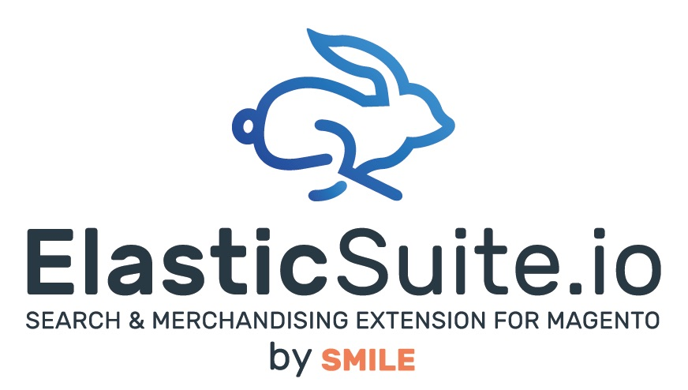
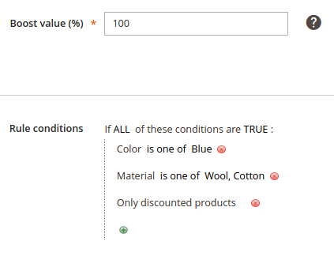
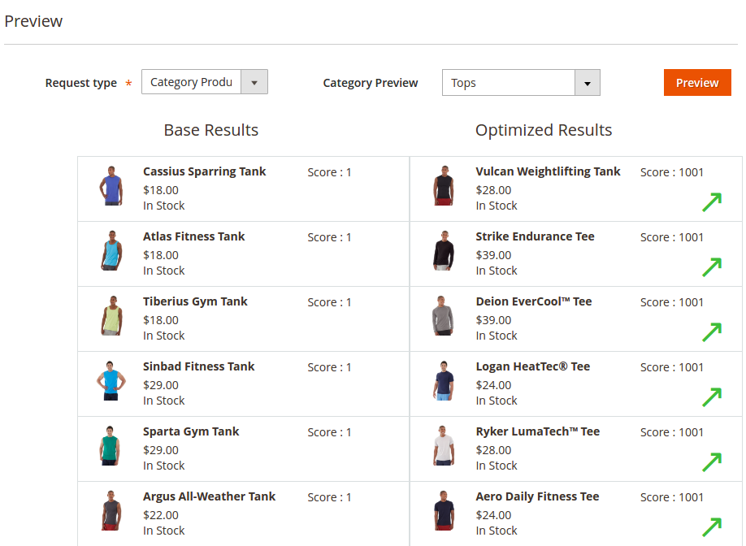
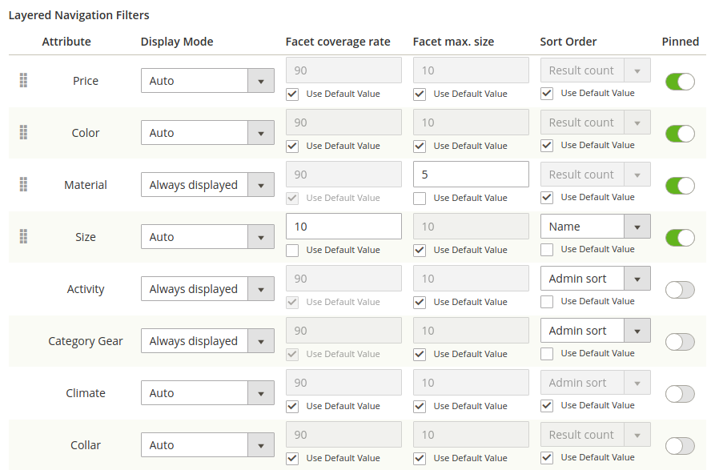
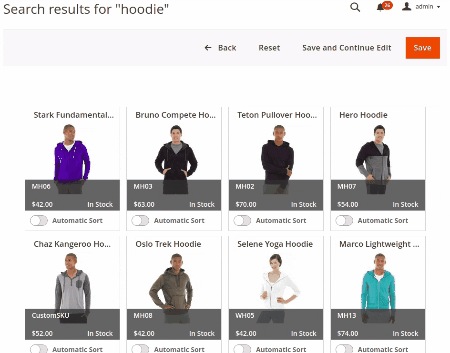
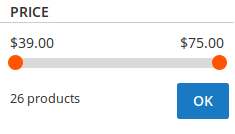
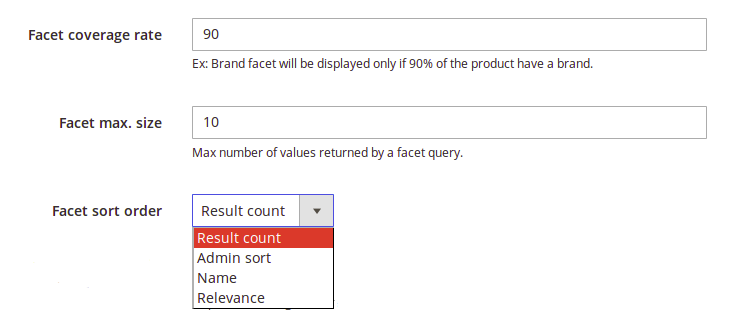

## News

### ⚠️ Magento versions compatibility :

Due to an update of the Unit test framework in Magento 2.2, we cannot ensure compatibility between ElasticSuite >2.4 and Magento 2.1.x versions.

If your project is based on Magento 2.2.x you can start working with ElasticSuite today using the latest **2.6.x release**.

**Which version should I use ?**

Magento Version                                     | ElasticSuite Latest Version
----------------------------------------------------|------------------------------------------------------------------------
Magento **2.0.x** Opensource (CE) / Commerce (EE)   |ElasticSuite **2.1.x** latest release : ```composer require smile/elasticsuite ^2.1.0```
Magento **2.1.x** Opensource (CE) / Commerce (EE)   |ElasticSuite **2.3.x** latest release : ```composer require smile/elasticsuite ^2.3.0```
Magento **2.2.x** Opensource (CE) / Commerce (EE)   |ElasticSuite **2.6.x** latest release : ```composer require smile/elasticsuite ^2.5.0```

### Magento2 B2B Compatibility

If your are using Magento Commerce (formerly known as Enterprise Edition) B2B feature with Elasticsuite, you will need to install the **Elasticsuite Shared Catalog** module which is located [here](https://github.com/Smile-SA/magento2-module-elasticsuite-shared-catalog)

### Introducing Elasticsuite modules

We are glad to announce officially that we now have a complete list of **additional modules to Elasticsuite**, which are all available for free and are published Open Source on Github :

Module Name                                                                                           | Description
------------------------------------------------------------------------------------------------------|------------------------------------------------------------------------
[CMS Search](https://github.com/Smile-SA/module-elasticsuite-cms-search)                              | Allow to search for CMS pages (in autocomplete and search results).
[Ratings](https://github.com/Smile-SA/magento2-module-elasticsuite-rating)                            | Allow to filter and/or sort on ratings (based on standard Magento rating module).
[Custom Entities](https://github.com/Smile-SA/magento2-module-elasticsuite-custom-entity)             | Ability to define complex entities as attributes (eg : having "brand" entities with pictures, description etc...)
[TargetRules with Elasticsearch](https://github.com/Smile-SA/magento2-module-elasticsuite-targetrule) | This module allow to compute target rules via Elasticsearch instead of full MySQL (**require Magento Commerce (EE)**).
[Elasticsuite for Retailers](https://github.com/Smile-SA/elasticsuite-for-retailer)                   | A complete suite of retail oriented modules : Store Locator, Price segmentation per store, etc...

### Community Add-ons

We have now some of our fellow users that are distributing **add-ons for ElasticSuite**. We would like to thanks them for supporting and using ElasticSuite.

Here is a list of currently published add-ons :

Add-on Name                                                                                           | Description
------------------------------------------------------------------------------------------------------|-----------------------------------------------------------
[ComWrap ElasticsuiteBlog](https://github.com/comwrap/Comwrap_ElasticsuiteBlog)                       | A bridge to use ElasticSuite with [MageFan Blog](https://github.com/magefan/module-blog). <br> It allows to index Blog posts into the search engine and display them into the autocomplete results, and also on the search result page.

## What is ElasticSuite for Magento 2 ?

ElasticSuite is a merchandising suite for Magento which aims to provide out the box a lot of features usually only available with proprietary merchandising tools.

The project was originally created by Smile and released to the Open Source community for Magento 1.x. You can still find the Magento 1.x module [here](https://github.com/Smile-SA/smile-magento-elasticsearch).

## Who is developing ElasticSuite ?

<p align="center">
    <a href="http://www.smile-oss.com"></a>
</p>

SmileLab is the innovation and experimentation department of Smile. Smile is the **European leader of Open Source** and also a four-times **Europe Partner of the the Year** (2010-2014), two-times **Spirit of Excellence** (2015-2016) and **Global Elite Partner** (2017) awarded by Magento.

Our multidisciplinary team brings together experts in technology, innovation, and new applications.

Together we explore, invent, and test technologies of the future, to better serve our clients.

## Where can I see it in action ?

A demonstration store including the latest version of ElasticSuite is available here : [ElasticSuite Demo](http://demo.magento-elastic-suite.io/)

## Main Features

### Current version

The current version **2.6.0** has been focused on the **Elasticsearch 6.x compatibility**, improving **Merchandising features** and technical update that aims to bring support for **Magento 2.3.x**.

Feel free to read the whole changelog of this version [here](https://github.com/Smile-SA/elasticsuite/releases/tag/2.6.0)

This version is designed to be used on both Magento Open Source and Commerce versions >2.2.

Actually, there are the features actually included :

<br/>

* **Virtual categories :**

    ElasticSuite allows you to **define categories based on rules** (in addition to the standard manual selection). The rule definition is based on the Magento rules components, so you will not be disoriented.
    You are able to define categories such as "All products for men that are currently discounted".

    The engine will automatically refresh products matching the selection in Front-Office and will prevent you from having to re-assign products manually.

    

    A dynamic preview of the results in the Back-Office is also included for more convenience.

<br/>

* **Search optimizations :**

    ElasticSuite also features several ways to **optimize the search engine relevance**. This part is again based on rules that can be defined in the Magento's back-office.

    This allows you to create rules like "Boost all products that are in stock", "Boost all new products", "Boost men products", etc ...

    

    You are also able to **preview each fine-tuning before publishing it** :

    

<br/>

* **Categories Merchandising :**

    A new **Merchandising** panel has been added into the category edition screen of Magento's Back-Office. It features a **direct preview** of the current product list according to category settings.

    Inside this panel, you are also able to use a **drag-and-drop interface** to apply custom sort order on some of the category products.

    This feature is compatible with "standard" categories but also with the Virtual Categories described before.

    

<br/>

* **Facet Management by category :**

    Inside the **Display Settings** panel of each category, you will be able to customize various layered navigation filters parameters :

    - Filter position (pinned/unpinned)
    - Display mode (always hidden, always displayed, automatic mode)
    - Facet Max Size
    - Facet coverage
    - Facet sort order

    This allow you to have a deeper level of configuration for your layered navigation for each category.

    

<br/>

* **Search Terms Merchandising :**

    A new **Merchandiser** link has been added into the search term screen of Magento's Back-Office. It features a **direct preview** of the current product list that will be returned by this search query in front office.

    Inside this panel, you are also able to use a **drag-and-drop interface** to apply custom sort order on some of the products (Eg : to ensure your bestseller always appear at first position).

    

<br/>

* **Products, Categories & Attributes autocomplete  :**

    ElasticSuite features **enhanced content in the autocomplete box** : popular search terms, **products and categories**, and also **attributes**.

    The autocomplete is **fully extensible to add custom content**, such as shop pages (if your store uses a store locator), CMS pages, etc...

    You can see the [wiki page](https://github.com/Smile-SA/elasticsuite/wiki) about adding custom content into the autocomplete results.

    

<br/>

* **Enhanced thesaurus management :**

    Thesaurus are now managed directly by the engine instead of the legacy Magento's behavior.

    Our module allows you to add complete thesauri in the Magento Back-Office. Actually, the module supports **two types of thesauri** :

    - Synonyms : standard synonym feature, let you contribute a list of terms which are synonyms of each others.

    

    This means that adding a synonym between *"men"* and *"man"* will make it working in all queries containing *"men"* like *"men shirt"* or *"men pants"* instead of having to define a synonym for each query.

    - Expansions : this kind of thesaurus allows to expand all search for a given term to an other list of terms.

    

    This means that adding an expansion between *"sport"* and *"fitness, gym, running"* will make it expanding for all queries containing *"sport"* like *"sport shoes"* (which would be expanded to "fitness shoes", "gym shoes", and "running shoes").

<br/>

* **Autocomplete in layered navigation filters :**

    The module allows the users to search into filters values **via an autocomplete box**.

    

<br/>

* **Enhanced price slider :**

    The module features an **out of the box price slider**.

    

<br/>

* **Multiple select in layered navigation :**

    The module allows customers to **apply multiple values of the same filter** criteria.

    

<br/>

* **Multiple select for swatches :**

    Same as above, the module allow the users to **choose several swatches** for filtering.

    

<br/>

* **Redirect on one result :**

    The module allow to redirect to the product page when a full text search matches only one product.

    

<br/>

* **Approaching search and spellchecking :**

    The module **automatically detects typing mistakes** and handles correct results for them. Don't worry about "fat-finger syndrome" anymore !

    

<br/>

* **Automatic stopwords detection :**

    The module is able to **automatically detect "stopwords"** based on their frequency into the search index.
    This means the engine is able to deal with queries containing stopwords, but also with **pure stopwords queries** such as "to be or not to be" or even "he and she"!

<br/>

* **Fully Configurable relevance configuration :**

    You are able to customize - on your own, via a dedicated screen in Magento's back-office - each technical parameters that are used to communicate with ElasticSearch.
    Doig so, you can **fine-tune the engine's configuration** to fit your needs according to your store's data typology.

<br/>

* **Customizable filters :**

    Each attribute can now be configured in Magento's back-office to **change its behavior when used for filtering**

   -  Conditional display of the filter based on its coverage rate.
   -  Maximum number of elements displayed by the filter.
   -  Sort order of elements of the filter.

    

<br/>


### And more to come !

The next versions that will be coming all among this year will include the following features :

* **Search usage dashboard :**

    Next version of ElasticSuite will feature an advanced dashboard where you will be able to see the following items :

     + **Generic KPIs** (number of search, page views, sessions, searches per session, unique visitors ...)
     + Search queries list (**most popular**, commons mispelling, **low conversion queries**, **zero results queries** ...)
     + Graphs (pie chart for misspelled queries, **line chart figuring the evolution of the number of queries**...)

* **Behavioral Search optimizations :**

    Second part of the relevance optimization features will be the behavioral optimizers. This will allow you to build **rules matching your customer's behavior**.
    Thanks to this feature, optimization rules like "Apply a boost for most viewed products" or "Boost the top sales products" are now possible to create.

* **Recommendations engine :**

    On top of the behavioral analysis part will come our recommendations engine. It will allow you to propose **custom recommendations to your customers, based on their previous visits on your websites**, and on other customer behaviors.

    Planned recommendations features are :
     + "Customers also bought"
     + Similar products
     + Cross Selling
     + Per-user recommendations, based on current customer profile and its previous visits and orders.
     + Per-search recommendations, to push products that were bought by previous users that have searched for the same terms.
     + And more to come !

* **And many of our users' RFCs !**

    There are now many people using ElasticSuite and we are very happy to see this ! **Feel free to share you RFCs** with us by submitting issues !


## Documentation

Documentation is available [here](https://github.com/Smile-SA/elasticsuite/wiki).

The User Guide is also available on PDF format [here](doc/static/User%20Guide-ElasticSuite%20for%20Magento%202-v2.5.pdf)

## Standards & Code Quality

Built on top of Magento2, our module respects all its prerequisites and code quality rules.

You can also find our PHPCS Standards and PHPMD rulesets in the **Resource** directory.

The module is also continuously tested on :

Tools                           | Results
------------------------------- |------------
Code Climate                    |[](https://codeclimate.com/github/Smile-SA/elasticsuite)
